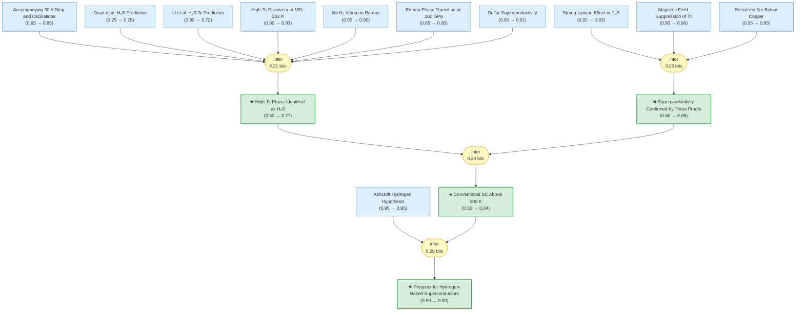

# h3s-superconductivity-gaia

Gaia knowledge package: Conventional superconductivity at 203 K in sulfur hydride (Drozdov et al., Nature 525, 73, 2015; arXiv:1412.0460)

<!-- badges:start -->
<!-- badges:end -->

## Overview

> [!TIP]
> **Reasoning graph information gain: `1.0 bits`**
>
> Total mutual information between leaf premises and exported conclusions — measures how much the reasoning structure reduces uncertainty about the results.

## Conclusions

| Label | Content | Prior | Belief |
|-------|---------|-------|--------|
| conventional_sc_above_200k | Conventional (phonon-mediated, BCS-type) superconductivity has been demonstra... | 0.50 | 0.84 |
| high_tc_is_h3s | The high-Tc superconductivity at ~190–203 K is attributed to H₃S (trihydrogen... | 0.50 | 0.77 |
| hydrogen_materials_prospect | Since H₂S has only a moderate hydrogen content, high-Tc superconductivity can... | 0.50 | 0.90 |
| superconductivity_confirmed | The observed resistance drops represent genuine superconducting transitions, ... | 0.50 | 0.89 |

<!-- content:start -->
<!-- content:end -->
