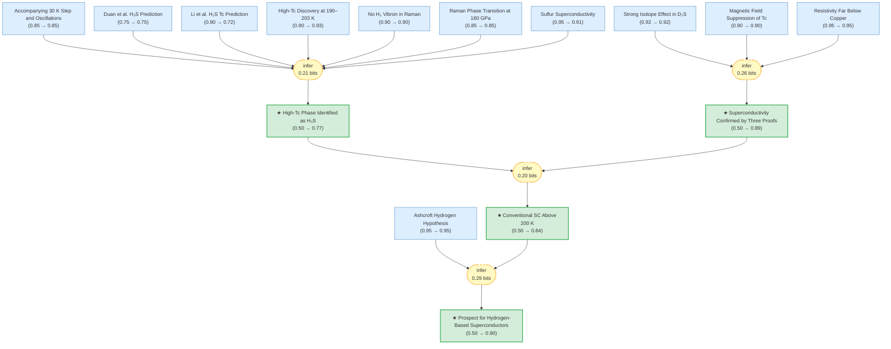
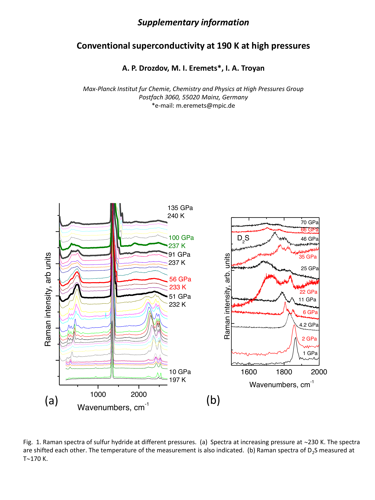
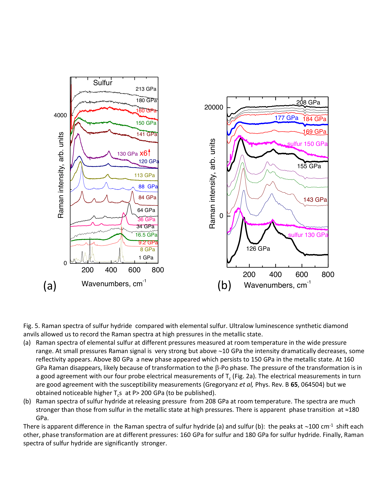
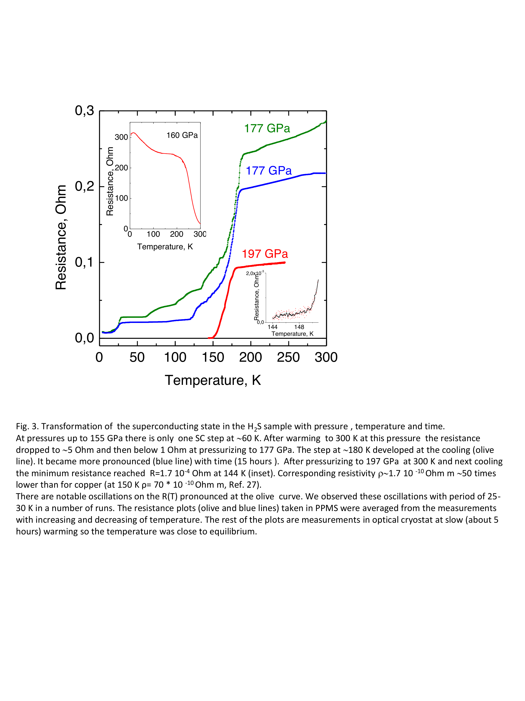
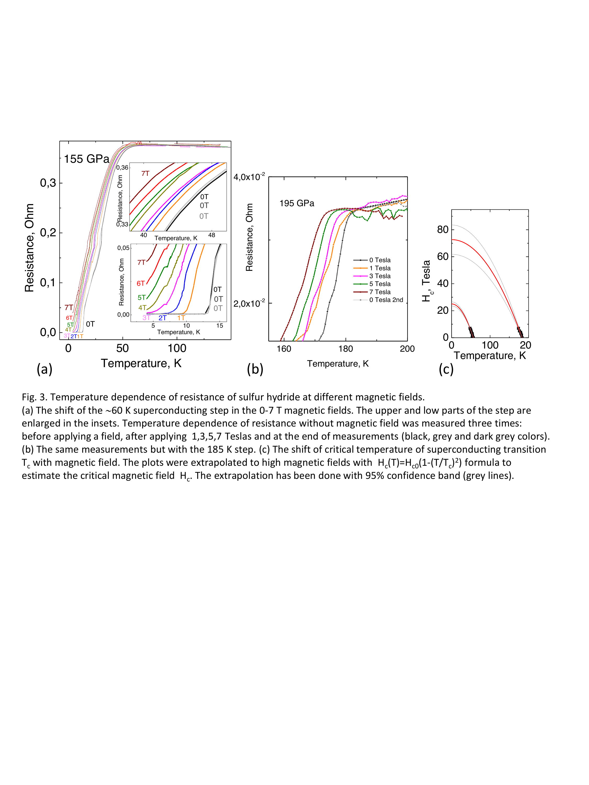
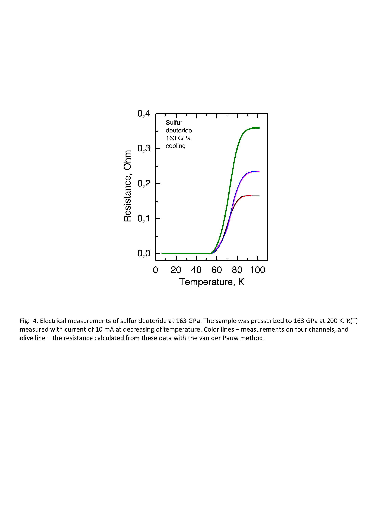
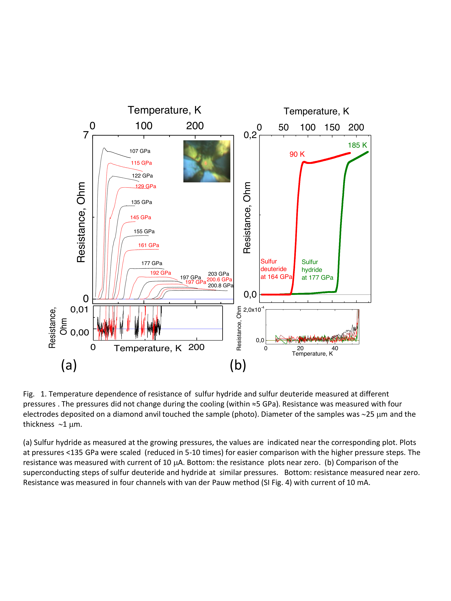
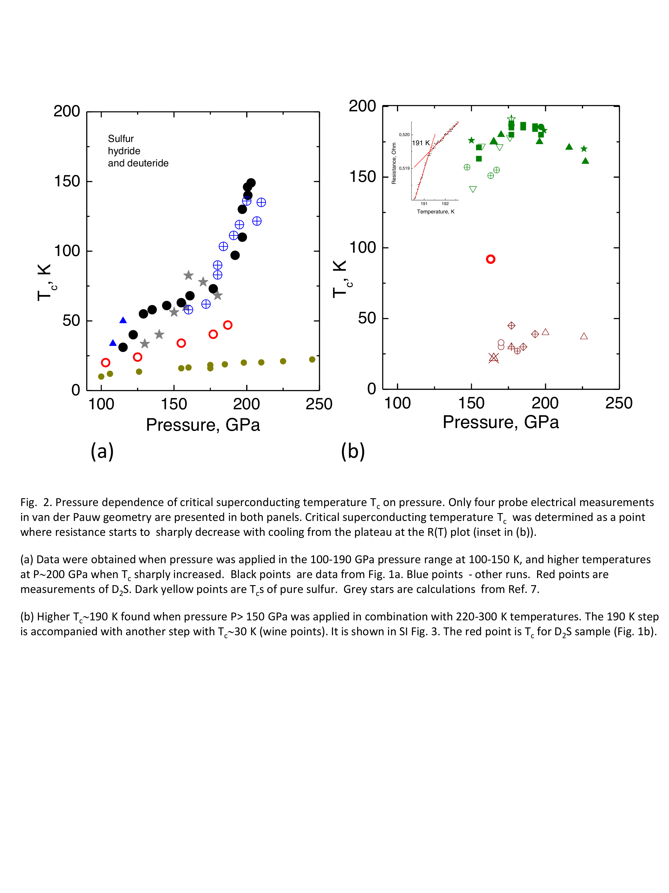

# Conventional Superconductivity at 203 K in Sulfur Hydride

> **Original work:** A.P. Drozdov, M.I. Eremets, I.A. Troyan, V. Ksenofontov & S.I. Shylin. "Conventional superconductivity at 203 kelvin at high pressures in the sulfur hydride system." *Nature* **525**, 73–76 (2015). [arXiv:1412.0460](https://arxiv.org/abs/1412.0460) | [DOI:10.1038/nature14964](https://doi.org/10.1038/nature14964)

> [!NOTE]
> This README is an AI-generated analysis based on a [Gaia](https://github.com/SiliconEinstein/Gaia) reasoning graph formalization of the original work. Belief values reflect the graph's probabilistic assessment of each claim's support, not the original authors' confidence.

## Summary

Drozdov et al. report the discovery of superconductivity at 203 K in sulfur hydride compressed above 150 GPa — at the time of publication the highest critical temperature ever observed in any material, surpassing the cuprate record of 164 K. The study identifies two distinct superconducting routes: a low-temperature path consistent with H₂S-phase predictions (Tc up to ~150 K), and a high-temperature path requiring thermal activation above 220 K that produces Tc ~ 190–203 K. The phonon-mediated (BCS) nature of the superconductivity is confirmed by a strong isotope effect (α ≈ 0.5) in D₂S substitution experiments, while the high-Tc phase is attributed to H₃S formed by pressure-induced decomposition of H₂S, consistent with independent theoretical predictions by Duan et al.

## Overview

> [!TIP]
> **Reasoning graph information gain: `1.0 bits`**
>
> Total mutual information between leaf premises and exported conclusions — measures how much the reasoning structure reduces uncertainty about the results.

## Reasoning Structure

### The high-Tc phase is identified as H₃S formed from H₂S decomposition (belief: 0.77)

The central interpretive claim of this work is that the superconducting phase with Tc ~ 190–203 K is not H₂S itself, but trihydrogen sulfide (H₃S) produced by pressure-induced decomposition of H₂S at temperatures above 220 K. This identification rests on a chain of elimination: pure H₂S calculations by Li et al. predict only Tc ~ 80 K and do not produce the high-Tc state; the decomposition product cannot be H₂ + S because no H₂ Raman vibron is observed and this reaction is calculated to be energetically unfavorable; elemental sulfur has far too low a Tc to account for the observations. Having excluded alternatives, the authors propose H₂S → H₃S + S, supported by Duan et al.'s independent theoretical prediction of Tc ~ 160–190 K for H₃S phases above 111 GPa, and by the observation of a Raman phase transition at 180 GPa matching Duan et al.'s predicted structural transition.

**Evidence support:**
- **Theoretical match** (Duan et al., belief 0.75): Predicted Tc ~ 190 K for H₃S and a structural transition at 180 GPa — both match experiment. However, structure prediction is not exhaustive; lower-energy phases may exist.
- **Spectroscopic support** (Raman transition at 180 GPa, belief 0.85): Phase transformation distinct from elemental sulfur's transition at 160 GPa, but pressure determination has ~5 GPa uncertainty.
- **Elimination of alternatives** (no H₂ vibron, belief 0.90; sulfur Tc too low, belief 0.91): Strong spectroscopic and thermodynamic evidence against H₂ + S decomposition; sulfur directly measured to have insufficient Tc.
- **Weakest link** (Li et al. prediction, belief 0.72): The H₂S theory that anchors the comparison has moderate uncertainty from structure search limitations.

| Evidence | Figure |
|----------|--------|
| Raman spectra — no H₂ vibron observed |  |
| Raman phase transition at ~180 GPa vs sulfur at ~160 GPa |  |

> The belief of 0.77 reflects the absence of direct structural characterization (XRD) of the high-Tc phase. The identification relies entirely on indirect evidence — matching Tc values, elimination of alternatives, and Raman spectroscopy. Later work by Einaga et al. (2016) confirmed the Im-3m H₃S structure by XRD, but that evidence is not part of this paper.

### The observed transitions represent genuine superconductivity, confirmed by three independent proofs (belief: 0.89)

The paper establishes superconductivity through three complementary tests. First, the measured resistivity drops to ρ ≤ 10⁻¹¹ Ω·m — two orders of magnitude below pure copper at the same temperature, with a specific measurement of 1.7 × 10⁻¹⁰ Ω·m at 144 K (50× below copper's 70 × 10⁻¹⁰ Ω·m at 150 K). This alone is sufficient to rule out normal metallic conduction. Second, the critical temperature shifts systematically to lower values under magnetic fields up to 7 T, with extrapolated upper critical fields of Hc2 ~ 25 T (for the 60 K state) and ~70 T (for the 185 K state), characteristic of type-II superconductors. Third, deuterium substitution (D₂S) halves the Tc for both superconducting states — exactly the BCS prediction for phonon-mediated pairing with isotope exponent α ≈ 0.5.

**Evidence support:**
- **Resistivity** (belief 0.95): Well-calibrated four-probe measurement with van der Pauw geometry; the factor of 50 below copper is unambiguous.
- **Magnetic field** (belief 0.90): Tc suppression clearly observed to 7 T; the uncertainty comes from the Hc2 extrapolation to ~70 T, which requires a large extrapolation from limited field range.
- **Isotope effect** (belief 0.92): The strongest proof of BCS mechanism. D₂S purity of 97% introduces slight uncertainty; the α ≈ 0.5 value is within BCS expectation.

| Evidence | Figure |
|----------|--------|
| Resistivity ρ ~ 1.7×10⁻¹⁰ Ω·m at 144 K, 50× below copper |  |
| Magnetic field suppression of Tc, Hc2 extrapolation |  |
| D₂S isotope effect: Tc halved (α ≈ 0.5) |  |

> The three proofs are independent and collectively provide very strong evidence. The main residual uncertainty is whether the resistance measurement geometry fully excludes filamentary conduction paths, but the magnitude of the drop (3–4 orders) and the coherent isotope effect make artifacts extremely unlikely.

### Conventional BCS-type superconductivity has been demonstrated above 200 K (belief: 0.84)

Combining the confirmation of phonon-mediated superconductivity (from the isotope effect) with the identification of H₃S as the responsible phase, this work establishes that conventional (BCS-type) superconductors can reach Tc above 200 K — shattering the longstanding prejudice that BCS superconductors are limited to ~30 K and surpassing even the cuprate record of 164 K under pressure. The Nature-published Tc of 203 K represents a clear demonstration that the Eliashberg formulation of BCS theory "puts no apparent bounds on Tc," as the authors note.

**Evidence support:**
- **Superconductivity confirmed** (belief 0.89): Strong three-proof evidence for genuine superconductivity.
- **H₃S identification** (belief 0.77): Moderate confidence that the phase is indeed H₃S — this is the weaker link. If the phase were not H₃S but some other hydrogen-sulfur compound, the Tc record would still stand but the material identification would change.

| Evidence | Figure |
|----------|--------|
| R(T) at multiple pressures — both routes |  |
| P–Tc phase diagram showing two superconducting routes |  |

> This conclusion is robust in the sense that the superconductivity itself is well-established (belief 0.89), but the specific material identification introduces a modest uncertainty. The 203 K value reported in Nature is higher than the arXiv preprint's 190 K, reflecting additional magnetic susceptibility data in the published version.

### High-Tc superconductivity can be expected in a wide range of hydrogen-containing materials (belief: 0.90)

The final implication of this work is perhaps the most consequential: since H₂S has only a moderate hydrogen content, materials with higher hydrogen fractions should achieve even higher Tc values. This validates Ashcroft's 1968 prediction that hydrogen-rich materials would be high-temperature superconductors, and opens a new field of hydrogen-based superconductor research. The authors specifically suggest carbon-based materials (fullerenes, aromatic hydrocarbons, graphanes) as candidates that might be made superconducting by doping or gating rather than extreme pressure.

**Evidence support:**
- **Conventional SC above 200 K** (belief 0.84): The demonstrated existence proof that BCS theory can produce very high Tc in a hydride.
- **Ashcroft hypothesis** (belief 0.95): Well-established theoretical framework predicting high Tc in hydrogen-rich materials, now experimentally validated.

> The high belief (0.90) reflects that this is a natural extension of well-supported physics. The practical prospect of room-temperature superconductivity at ambient pressure remains speculative, but the scientific basis for continued search is now firmly established. Subsequent discoveries of superconductivity in LaH₁₀ (Tc ~ 260 K) and other superhydrides have borne out this prediction.

## Conclusions

| Label | Content | Prior | Belief |
|-------|---------|-------|--------|
| superconductivity_confirmed | The observed resistance drops represent genuine superconducting transitions, confirmed by three independent lines of evidence | 0.50 | 0.89 |
| high_tc_is_h3s | The high-Tc superconductivity at ~190–203 K is attributed to H₃S formed by dissociation of H₂S under pressure | 0.50 | 0.77 |
| conventional_sc_above_200k | Conventional (phonon-mediated, BCS-type) superconductivity has been demonstrated above 200 K | 0.50 | 0.84 |
| hydrogen_materials_prospect | High-Tc superconductivity can be expected in a wide range of hydrogen-containing materials | 0.50 | 0.90 |

Weak Points Analysis

The weakest internal link in the reasoning chain is the **H₂S theory prediction by Li et al.** (belief drops from prior 0.80 to 0.72). This node is referenced both in the elimination argument (establishing what H₂S alone cannot explain) and in the H₃S formation hypothesis. The ab initio structure search by Li et al. may have missed lower-energy structures, and their predicted Tc ~ 80 K significantly underestimates the observed low-route Tc of ~150 K at 200 GPa. This discrepancy, while the paper attributes it to pressure-dependent effects, suggests that the H₂S phase diagram is more complex than calculated.

The **Duan et al. prediction** (belief 0.75) is the second weakest supporting node. While their predicted Tc ~ 190 K remarkably matches experiment, crystal structure prediction at these pressures is not exhaustive, and the (H₂S)₂H₂ van der Waals compound they studied may not be the actual precursor. The agreement in Tc could be partly coincidental — different crystal structures can produce similar Tc values.

The **Hc2 extrapolation** in the magnetic field proof requires extending from 7 T to estimated values of 25–70 T — a large extrapolation that relies on the simple formula Hc(T) = Hc0(1 − (T/Tc)²). Deviations from this formula are common in type-II superconductors, and the actual upper critical field could differ substantially.

The absence of **direct structural characterization** (X-ray diffraction under pressure) is the most significant gap. The H₃S identification relies entirely on matching Tc predictions and elimination of alternatives. Without XRD confirmation, the exact crystal structure and stoichiometry remain uncertain.

Evidence Gaps & Future Work

**Experimental gaps:**
- No X-ray diffraction data to confirm the crystal structure of the high-Tc phase. This is the single most impactful missing measurement — it would raise `high_tc_is_h3s` from 0.77 toward 0.95.
- Magnetic susceptibility measurements are mentioned only in the Nature version, not the arXiv preprint. Full Meissner effect characterization would strengthen `superconductivity_confirmed`.
- The pressure-temperature phase diagram has significant gaps, particularly in the transition region between the low-Tc and high-Tc routes.

**Computational gaps:**
- The Hc2 values (~25 T, ~70 T) are extrapolated from a maximum field of only 7 T. Direct measurement at higher fields would constrain the gap symmetry and pairing strength.
- The electron-phonon coupling constant λ for H₃S is not measured — only inferred from theoretical calculations. Tunneling spectroscopy could provide this.

**Theoretical gaps:**
- The exact decomposition mechanism (2H₂S → H₄S + S vs 3H₂S → H₆S + S) is not determined experimentally. Understanding the kinetics would explain the time-dependent behavior of the 30 K step.
- The R(T) oscillations with 25–30 K periodicity are unexplained. These could indicate multiple superconducting phases, proximity effects, or measurement artifacts.

