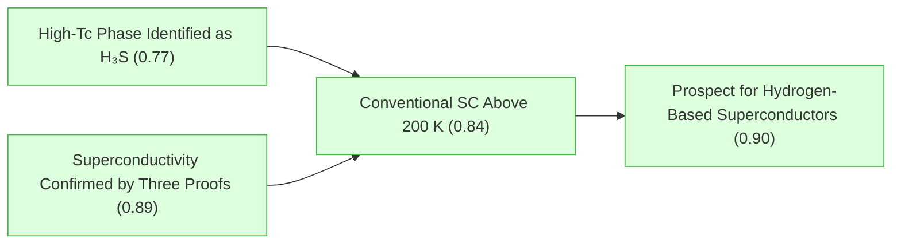
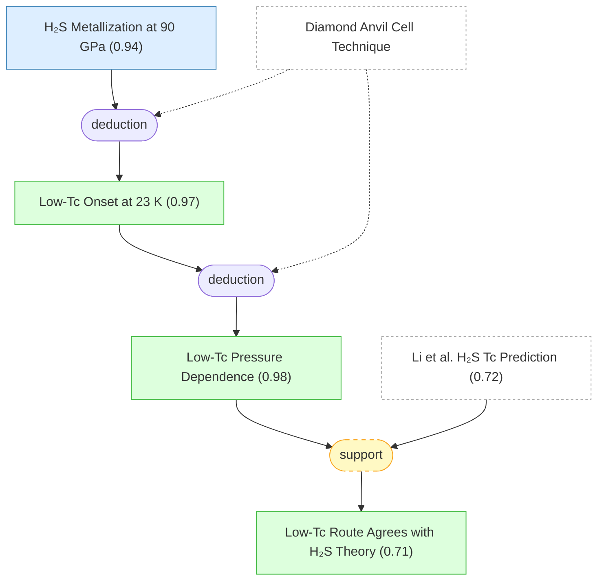
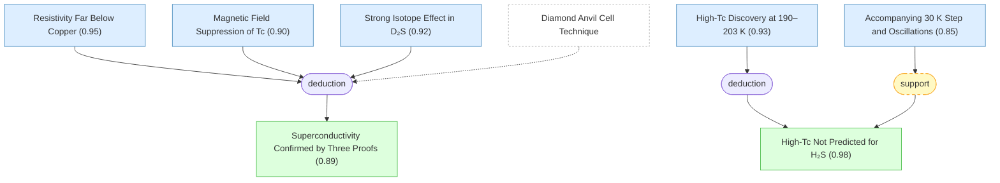
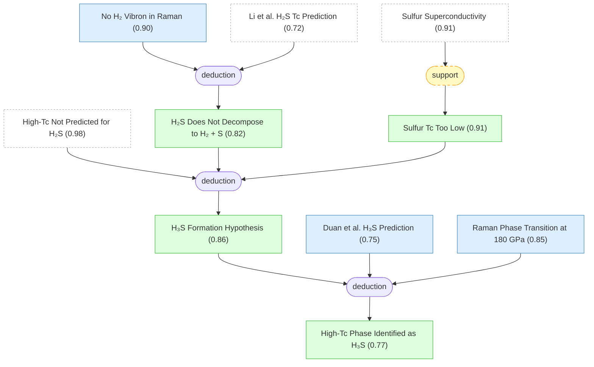
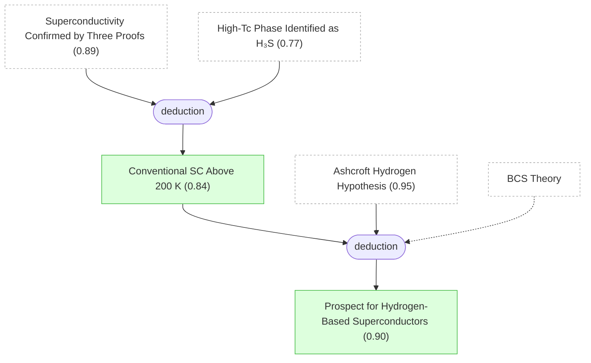

# h3s-superconductivity-gaia

Gaia knowledge package: Conventional superconductivity at 203 K in sulfur hydride (Drozdov et al., Nature 525, 73, 2015; arXiv:1412.0460)

## Overview

## Introduction

#### Superconductivity Confirmed by Three Proofs ★

📌 `superconductivity_confirmed`   |   Belief: **0.89**

> The observed resistance drops represent genuine superconducting transitions, confirmed by three independent lines of evidence: (1) resistivity far below copper, (2) magnetic field suppression of Tc, and (3) a strong isotope effect consistent with BCS theory. The high-Tc state at ~190–203 K is a conventional (phonon-mediated) superconductor.

🔗 **deduction**([Resistivity Far Below Copper](#resistivity_proof), [Magnetic Field Suppression of Tc](#magnetic_field_proof), [Strong Isotope Effect in D₂S](#isotope_effect))

Reasoning

Three independent tests confirm superconductivity: (1) ρ ≤ 10⁻¹¹ Ω·m is far below copper (@resistivity_proof), ruling out a normal metallic state; (2) Tc decreases with field up to 7 T (@magnetic_field_proof), the hallmark of superconductivity; (3) BCS isotope exponent α ≈ 0.5 from D₂S (@isotope_effect) identifies the phonon mechanism. Together these exclude artifacts such as filamentary conduction or measurement errors.

#### High-Tc Phase Identified as H₃S ★

📌 `high_tc_is_h3s`   |   Belief: **0.77**

> The high-Tc superconductivity at ~190–203 K is attributed to H₃S (trihydrogen sulfide) formed by dissociation of H₂S under pressure. This identification is supported by: (1) theoretical predictions from Duan et al. matching both the Tc values and structural transitions, (2) Raman evidence of a phase transition at 180 GPa consistent with H₃S, and (3) elimination of alternative explanations (pure H₂S, elemental sulfur, H₂ + S decomposition).

🔗 **deduction**([H₃S Formation Hypothesis](#h3s_formation_hypothesis), [Duan et al. H₃S Prediction](#duan_prediction), [Raman Phase Transition at 180 GPa](#raman_phase_transition))

Reasoning

The hypothesis that HₙS (n > 2) forms from H₂S decomposition (@h3s_formation_hypothesis) is confirmed by Duan et al.'s prediction of Tc ~ 190 K for H₃S (@duan_prediction) matching the observation, and Raman evidence of a phase transition at 180 GPa (@raman_phase_transition) matching the predicted structural transition. The convergence of elimination reasoning, theoretical prediction, and spectroscopic evidence identifies the high-Tc phase as H₃S.

#### Conventional SC Above 200 K ★

📌 `conventional_sc_above_200k`   |   Belief: **0.84**

> Conventional (phonon-mediated, BCS-type) superconductivity has been demonstrated above 190 K (arXiv) / 203 K (Nature) — the highest Tc for any superconductor at the time of publication. This breaks the long-standing preconception that BCS superconductors are limited to Tc ~ 30 K and surpasses even the cuprate record of 164 K under pressure.

🔗 **deduction**([Superconductivity Confirmed by Three Proofs](#superconductivity_confirmed), [High-Tc Phase Identified as H₃S](#high_tc_is_h3s))

Reasoning

The isotope effect confirms BCS phonon mechanism (@superconductivity_confirmed) and the material is identified as H₃S (@high_tc_is_h3s). Together these establish that a conventional superconductor has reached ~200 K.

#### Prospect for Hydrogen-Based Superconductors ★

📌 `hydrogen_materials_prospect`   |   Belief: **0.90**

> Since H₂S has only a moderate hydrogen content, high-Tc superconductivity can be expected in a wide range of hydrogen-containing materials. Candidates include carbon-based materials (fullerenes, aromatic hydrocarbons, graphanes) which could potentially be turned superconducting by doping or gating instead of extreme pressure. Hydrogen atoms are essential for providing high-frequency phonon modes and strong electron-phonon coupling.

🔗 **deduction**([Conventional SC Above 200 K](#conventional_sc_above_200k), [Ashcroft Hydrogen Hypothesis](#ashcroft_hydrogen))

Reasoning

The successful demonstration of ~200 K conventional SC in H₃S (@conventional_sc_above_200k) validates Ashcroft's hypothesis (@ashcroft_hydrogen) that hydrogen-rich materials can achieve extremely high Tc via BCS mechanism (@bcs_theory). Since H₂S has only moderate hydrogen content, materials with higher hydrogen fraction could reach even higher temperatures.

## Section 1: Background and Theoretical Context

#### BCS Theory

📋 `bcs_theory`

> Bardeen-Cooper-Schrieffer (BCS) theory: phonon-mediated electron-electron attraction leads to Cooper pairing. The Eliashberg formulation puts no apparent bounds on Tc. High Tc requires: (1) high-frequency phonons, (2) strong electron-phonon coupling, (3) high density of states.

#### Cuprate Tc Record

📋 `cuprate_record`

> Prior to this work, the highest superconducting transition temperatures were in cuprates: Tc = 133 K at ambient pressure (HgBa₂Ca₂Cu₃O₈₊δ) and 164 K under high pressure. Cuprate superconductivity is unconventional — its mechanism remains undisclosed.

#### Conventional Tc Limit Before This Work

📋 `conventional_tc_limit`

> The highest Tc achieved through conventional (BCS-type) superconductor search prior to this work was 39 K in MgB₂. A common preconception held that Tc ~ 30 K is the maximum achievable in conventional superconductors.

#### Diamond Anvil Cell Technique

📋 `diamond_anvil_cell`

> Diamond anvil cell (DAC) enables static high-pressure experiments up to hundreds of GPa. The sample (diameter ~10 μm, thickness ~1 μm) is clamped in a metallic gasket between diamond anvils. Resistance is measured by four-probe Van der Pauw method with sputtered Ti/Au electrodes insulated from the gasket by Teflon or NaCl.

#### Ashcroft Hydrogen Hypothesis

📌 `ashcroft_hydrogen`   |   Prior: 0.95   |   Belief: **0.95**

> Ashcroft (1968) predicted that metallic hydrogen would be a high-temperature superconductor due to: (1) very high vibrational frequencies from the light hydrogen atom, (2) strong electron-phonon interaction, and (3) covalent bonding. Subsequent calculations predict Tc = 100–240 K for molecular hydrogen and 300–350 K for the atomic phase at 500 GPa.

#### Hydrogen-Dominant Alloy Prediction

📌 `hydrogen_dominant_alloys`   |   Belief: **0.97**

> Ashcroft (2004) proposed that hydrogen-dominant metallic alloys (covalent hydrides such as SiH₄, SnH₄) could also be high-Tc superconductors: they share hydrogen's high Debye temperature while requiring lower metallization pressures than pure hydrogen. Heavier elements may additionally contribute low-frequency modes that enhance electron-phonon coupling.

🔗 **deduction**([Ashcroft Hydrogen Hypothesis](#ashcroft_hydrogen))

Reasoning

If metallic hydrogen is a high-Tc superconductor due to light-atom phonon frequencies and strong e-ph coupling (@ashcroft_hydrogen), then hydrogen-dominant compounds should retain these favorable properties while requiring lower pressures for metallization, following the BCS guide (@bcs_theory).

#### Li et al. H₂S Tc Prediction

📌 `h2s_theory_prediction`   |   Prior: 0.80   |   Belief: **0.72**

> Li et al. (2014) predicted from ab initio calculations that H₂S metallizes at ~96 GPa and becomes a superconductor with Tc ~ 80 K at 160 GPa. At P > 130 GPa, new stable structures were found. Precipitation of sulfur was predicted to be 'very unlikely.'

#### Prior Hydride Tc Record

📌 `silane_tc`   |   Prior: 0.90   |   Belief: **0.90**

> Prior to this work, only moderate Tc ~ 17 K had been observed experimentally in hydrogen-dominant materials (superconductivity in silane, SiH₄, by Eremets et al. 2008), far below theoretical predictions of Tc = 100–235 K for various hydrides.

#### Sulfur Superconductivity

📌 `sulfur_sc`   |   Prior: 0.95   |   Belief: **0.91**

> Elemental sulfur becomes metallic above 95 GPa and is a superconductor, but with a low Tc (measured values shown in Fig. 2a as dark yellow points). Sulfur superconductivity alone cannot explain the high Tc observed in H₂S samples.

#### H₂S Selected for Experiment

📌 `h2s_chosen_for_study`   |   Belief: **0.81**

> H₂S was selected as the experimental target because: (1) it is relatively easy to handle, (2) it transforms to metal at a comparatively low pressure of ~100 GPa, and (3) the predicted Tc = 80 K is high enough to motivate experimental verification.

🔗 **deduction**([Hydrogen-Dominant Alloy Prediction](#hydrogen_dominant_alloys), [Li et al. H₂S Tc Prediction](#h2s_theory_prediction), [Prior Hydride Tc Record](#silane_tc))

Reasoning

The prediction that hydrogen-dominant compounds can be high-Tc superconductors (@hydrogen_dominant_alloys) combined with the specific prediction of Tc ~ 80 K for H₂S at accessible pressures (@h2s_theory_prediction) makes H₂S an attractive target — especially since prior hydride experiments only reached Tc ~ 17 K in SiH₄ (@silane_tc), far below theoretical predictions.

#### Main Question: High-Tc in Sulfur Hydride

❓ `main_question`

> Can sulfur hydride (H₂S) under high pressure achieve superconducting transition temperatures significantly beyond those predicted by Li et al. (Tc ~ 80 K), and if so, what mechanism underlies the enhancement?

## Section 2: Metallization and Low-Tc Superconductivity

#### H₂S Metallization at 90 GPa

📌 `h2s_metallization`   |   Prior: 0.95   |   Belief: **0.94**

> H₂S starts to conduct at P ~ 50 GPa (semiconductor with photoconductivity). At 90–100 GPa, the temperature dependence becomes metallic and photoconductivity disappears. H₂S is a poor metal: resistivity ρ ~ 3×10⁻⁵ Ω·m at 110 GPa, decreasing to ρ ~ 3×10⁻⁷ Ω·m at ~200 GPa.

#### Low-Tc Onset at 23 K

📌 `low_tc_onset`   |   Belief: **0.97**

> When the metallic H₂S phase is cooled to 4 K at ~100 GPa, the resistance drops abruptly by 3–4 orders of magnitude at Tc ~ 23 K, indicating the onset of superconductivity.

🔗 **deduction**([H₂S Metallization at 90 GPa](#h2s_metallization))

Reasoning

Once H₂S is metallic (@h2s_metallization), cooling reveals a sharp resistance drop at Tc ~ 23 K — the characteristic signature of a superconducting transition. The metallic state is a prerequisite for observing superconductivity.

#### Low-Tc Pressure Dependence

📌 `low_tc_pressure_dependence`   |   Belief: **0.98**

> In the low-temperature route (pressure applied at 100–150 K), Tc increases with pressure from ~23 K at 100 GPa, with sharp growth approaching 200 GPa, reaching up to ~150 K at ~200 GPa.

🔗 **deduction**([Low-Tc Onset at 23 K](#low_tc_onset))

Reasoning

Systematic measurements at increasing pressures (@low_tc_onset at each pressure step) reveal a monotonic increase of Tc with pressure, with sharp enhancement near 200 GPa. Pressures were determined by the diamond edge scale (@diamond_anvil_cell).

#### Low-Tc Route Agrees with H₂S Theory

📌 `low_tc_agrees_with_theory`   |   Belief: **0.71**

> The low-temperature route Tc values (up to ~150 K at ~200 GPa) are in reasonable agreement with Li et al.'s prediction of Tc ~ 80 K for H₂S. The experimental values exceed the prediction, and the pressure dependence differs (no predicted drop of Tc at 160 GPa), but the overall scale and trend are consistent with H₂S-phase superconductivity.

🔗 **support**([Low-Tc Pressure Dependence](#low_tc_pressure_dependence), [Li et al. H₂S Tc Prediction](#h2s_theory_prediction))

Reasoning

The experimentally observed Tc range (@low_tc_pressure_dependence) is broadly consistent with the ab initio prediction of Tc ~ 80 K (@h2s_theory_prediction), supporting that the low-Tc route represents conventional superconductivity in H₂S phases.

## Section 3: High-Tc Discovery — 190–203 K Superconductivity

#### High-Tc Discovery at 190–203 K

📌 `high_tc_discovery`   |   Prior: 0.90   |   Belief: **0.93**

> A second superconducting state with Tc ~ 190 K (arXiv v1) / 203 K (Nature) is found by applying pressure P > 150 GPa at temperatures T > 220 K (high-temperature route). This Tc has weak pressure dependence — qualitatively different from the low-T route.

#### High-Tc Not Predicted for H₂S

📌 `high_tc_not_predicted`   |   Belief: **0.98**

> The high-Tc state (Tc ~ 190 K) is NOT seen or predicted in the Li et al. calculations for H₂S. The requirement of high temperature (T > 220 K) during pressurization suggests a chemical transformation (decomposition of H₂S) is involved in reaching this state.

🔗 **support**([Accompanying 30 K Step and Oscillations](#accompanying_30k_step))

Reasoning

The transient 30 K step (@accompanying_30k_step) that disappears with time while the 190 K step sharpens is consistent with a kinetically-controlled chemical transformation producing the high-Tc phase — supporting the conclusion that H₂S decomposition is involved.

#### Accompanying 30 K Step and Oscillations

📌 `accompanying_30k_step`   |   Prior: 0.85   |   Belief: **0.85**

> The 190 K superconducting step is frequently accompanied by a second step at Tc ~ 30 K, which disappears with time (>1 day) or further pressure application while the 190 K step sharpens. R(T) oscillations with a period of 25–30 K are observed in multiple runs.

#### Resistivity Far Below Copper

📌 `resistivity_proof`   |   Prior: 0.95   |   Belief: **0.95**

> The minimum resistance in the high-Tc state corresponds to resistivity ρ ≤ 10⁻¹¹ Ω·m — about two orders of magnitude less than pure copper at the same temperature. At 144 K specifically: ρ = 1.7×10⁻¹⁰ Ω·m, which is 50 times lower than copper (ρ_Cu = 70×10⁻¹⁰ Ω·m at 150 K).

#### Magnetic Field Suppression of Tc

📌 `magnetic_field_proof`   |   Prior: 0.90   |   Belief: **0.90**

> Tc shifts to lower temperatures with magnetic field up to 7 Tesla for both superconducting states. Extrapolation using Hc(T) = Hc0·(1 − (T/Tc)²) gives estimated upper critical fields: Hc2 ~ 25 T for the Tc ~ 60 K state and Hc2 ~ 70 T for the Tc ~ 185 K state. The high Hc2 is characteristic of a type-II superconductor.

#### Strong Isotope Effect in D₂S

📌 `isotope_effect`   |   Prior: 0.92   |   Belief: **0.92**

> Deuterium substitution (D₂S) shows a strong isotope effect: H₂S Tc ~ 60 K → D₂S Tc ~ 30 K, and H₂S Tc ~ 185 K → D₂S Tc ~ 90 K. The isotope exponent α ≈ 0.5, matching the BCS prediction Tc ∝ M^(−α) with α = 0.5 for the phonon mechanism. This confirms phonon-mediated (conventional BCS) superconductivity.

#### Superconductivity Confirmed by Three Proofs ★

📌 `superconductivity_confirmed`   |   Belief: **0.89**

> The observed resistance drops represent genuine superconducting transitions, confirmed by three independent lines of evidence: (1) resistivity far below copper, (2) magnetic field suppression of Tc, and (3) a strong isotope effect consistent with BCS theory. The high-Tc state at ~190–203 K is a conventional (phonon-mediated) superconductor.

🔗 **deduction**([Resistivity Far Below Copper](#resistivity_proof), [Magnetic Field Suppression of Tc](#magnetic_field_proof), [Strong Isotope Effect in D₂S](#isotope_effect))

Reasoning

Three independent tests confirm superconductivity: (1) ρ ≤ 10⁻¹¹ Ω·m is far below copper (@resistivity_proof), ruling out a normal metallic state; (2) Tc decreases with field up to 7 T (@magnetic_field_proof), the hallmark of superconductivity; (3) BCS isotope exponent α ≈ 0.5 from D₂S (@isotope_effect) identifies the phonon mechanism. Together these exclude artifacts such as filamentary conduction or measurement errors.

## Section 4: Interpretation — H₃S Formation from H₂S Decomposition

#### No H₂ Vibron in Raman

📌 `no_h2_vibron`   |   Prior: 0.90   |   Belief: **0.90**

> The strong characteristic vibron of molecular H₂ was never observed in Raman spectra despite using a sensitive spectrometer and ultralow luminescence synthetic diamond anvils. This rules out simple decomposition H₂S → H₂ + S.

#### H₂S Does Not Decompose to H₂ + S

📌 `h2s_decomposition_not_to_h2`   |   Belief: **0.82**

> The decomposition reaction H₂S → H₂ + S is ruled out by two independent lines of evidence: (1) no H₂ vibron observed in Raman, and (2) Li et al. calculations showed this reaction is 'energetically very unfavorable.'

🔗 **deduction**([No H₂ Vibron in Raman](#no_h2_vibron), [Li et al. H₂S Tc Prediction](#h2s_theory_prediction))

Reasoning

The absence of H₂ Raman vibron (@no_h2_vibron) provides direct spectroscopic evidence against H₂ formation, while Li et al.'s thermodynamic calculations (@h2s_theory_prediction) independently show H₂S → H₂ + S is energetically unfavorable.

#### Sulfur Tc Too Low

📌 `sulfur_tc_too_low`   |   Belief: **0.91**

> Elemental sulfur precipitates from H₂S at P > 27 GPa. While sulfur is metallic and superconducting above 95 GPa, its Tc values (measured in this work, Fig. 2a dark yellow points) are far too low to explain the 190 K transition. Sulfur alone cannot be the source of the high-Tc state.

🔗 **support**([Sulfur Superconductivity](#sulfur_sc))

Reasoning

Direct measurements of elemental sulfur Tc (@sulfur_sc) under comparable pressure conditions show values well below 190 K, ruling out sulfur as the sole source of the high-Tc phase.

#### H₃S Formation Hypothesis

📌 `h3s_formation_hypothesis`   |   Belief: **0.86**

> The dissociation of H₂S under high pressure and temperature produces higher sulfur hydrides HₙS (n > 2) rather than H₂ + S. Proposed reactions: 2H₂S → H₄S + S, or 3H₂S → H₆S + S. These are plausible because sulfur has valency 2, 4, and 6; H₄S and H₆S are thermodynamically unstable but kinetically stable at ambient pressure, and high pressure may stabilize them.

🔗 **deduction**([High-Tc Not Predicted for H₂S](#high_tc_not_predicted), [H₂S Does Not Decompose to H₂ + S](#h2s_decomposition_not_to_h2), [Sulfur Tc Too Low](#sulfur_tc_too_low))

Reasoning

Since the high-Tc state is not explained by H₂S (@high_tc_not_predicted), simple H₂ + S decomposition is excluded (@h2s_decomposition_not_to_h2), and sulfur alone has too low Tc (@sulfur_tc_too_low), the material must be a higher hydride HₙS (n > 2) formed from H₂S decomposition.

#### Duan et al. H₃S Prediction

📌 `duan_prediction`   |   Prior: 0.75   |   Belief: **0.75**

> Duan et al. (2014) studied the van der Waals compound (H₂S)₂H₂ and predicted: (1) above 111 GPa, H₃S molecular units form; (2) above 180 GPa, sulfur coordination number reaches 6; (3) Tc ~ 160 K and ~190 K for these two phases. These predictions closely match the experimental observations.

#### Raman Phase Transition at 180 GPa

📌 `raman_phase_transition`   |   Prior: 0.85   |   Belief: **0.85**

> Raman measurements of the sample with Tc ~ 190 K show a phase transformation at ~180 GPa upon pressure release. This matches the predicted structural transition in Duan et al.'s calculations and is distinct from elemental sulfur's phase transition at ~160 GPa.

#### High-Tc Phase Identified as H₃S ★

📌 `high_tc_is_h3s`   |   Belief: **0.77**

> The high-Tc superconductivity at ~190–203 K is attributed to H₃S (trihydrogen sulfide) formed by dissociation of H₂S under pressure. This identification is supported by: (1) theoretical predictions from Duan et al. matching both the Tc values and structural transitions, (2) Raman evidence of a phase transition at 180 GPa consistent with H₃S, and (3) elimination of alternative explanations (pure H₂S, elemental sulfur, H₂ + S decomposition).

🔗 **deduction**([H₃S Formation Hypothesis](#h3s_formation_hypothesis), [Duan et al. H₃S Prediction](#duan_prediction), [Raman Phase Transition at 180 GPa](#raman_phase_transition))

Reasoning

The hypothesis that HₙS (n > 2) forms from H₂S decomposition (@h3s_formation_hypothesis) is confirmed by Duan et al.'s prediction of Tc ~ 190 K for H₃S (@duan_prediction) matching the observation, and Raman evidence of a phase transition at 180 GPa (@raman_phase_transition) matching the predicted structural transition. The convergence of elimination reasoning, theoretical prediction, and spectroscopic evidence identifies the high-Tc phase as H₃S.

## Section 5: Implications for Hydrogen-Based Superconductors

#### Conventional SC Above 200 K ★

📌 `conventional_sc_above_200k`   |   Belief: **0.84**

> Conventional (phonon-mediated, BCS-type) superconductivity has been demonstrated above 190 K (arXiv) / 203 K (Nature) — the highest Tc for any superconductor at the time of publication. This breaks the long-standing preconception that BCS superconductors are limited to Tc ~ 30 K and surpasses even the cuprate record of 164 K under pressure.

🔗 **deduction**([Superconductivity Confirmed by Three Proofs](#superconductivity_confirmed), [High-Tc Phase Identified as H₃S](#high_tc_is_h3s))

Reasoning

The isotope effect confirms BCS phonon mechanism (@superconductivity_confirmed) and the material is identified as H₃S (@high_tc_is_h3s). Together these establish that a conventional superconductor has reached ~200 K.

#### Prospect for Hydrogen-Based Superconductors ★

📌 `hydrogen_materials_prospect`   |   Belief: **0.90**

> Since H₂S has only a moderate hydrogen content, high-Tc superconductivity can be expected in a wide range of hydrogen-containing materials. Candidates include carbon-based materials (fullerenes, aromatic hydrocarbons, graphanes) which could potentially be turned superconducting by doping or gating instead of extreme pressure. Hydrogen atoms are essential for providing high-frequency phonon modes and strong electron-phonon coupling.

🔗 **deduction**([Conventional SC Above 200 K](#conventional_sc_above_200k), [Ashcroft Hydrogen Hypothesis](#ashcroft_hydrogen))

Reasoning

The successful demonstration of ~200 K conventional SC in H₃S (@conventional_sc_above_200k) validates Ashcroft's hypothesis (@ashcroft_hydrogen) that hydrogen-rich materials can achieve extremely high Tc via BCS mechanism (@bcs_theory). Since H₂S has only moderate hydrogen content, materials with higher hydrogen fraction could reach even higher temperatures.

## Inference Results

**BP converged:** True (2 iterations)

| Label | Type | Prior | Belief | Role |
|-------|------|-------|--------|------|
| [low_tc_agrees_with_theory](#low_tc_agrees_with_theory) | claim | — | 0.7092 | derived |
| [h2s_theory_prediction](#h2s_theory_prediction) | claim | 0.80 | 0.7164 | independent |
| [duan_prediction](#duan_prediction) | claim | 0.75 | 0.7500 | independent |
| [high_tc_is_h3s](#high_tc_is_h3s) | claim | — | 0.7742 | derived |
| [h2s_chosen_for_study](#h2s_chosen_for_study) | claim | — | 0.8128 | derived |
| [h2s_decomposition_not_to_h2](#h2s_decomposition_not_to_h2) | claim | — | 0.8213 | derived |
| [conventional_sc_above_200k](#conventional_sc_above_200k) | claim | — | 0.8440 | derived |
| [accompanying_30k_step](#accompanying_30k_step) | claim | 0.85 | 0.8455 | independent |
| [raman_phase_transition](#raman_phase_transition) | claim | 0.85 | 0.8500 | independent |
| [h3s_formation_hypothesis](#h3s_formation_hypothesis) | claim | — | 0.8631 | derived |
| [superconductivity_confirmed](#superconductivity_confirmed) | claim | — | 0.8918 | derived |
| [hydrogen_materials_prospect](#hydrogen_materials_prospect) | claim | — | 0.8994 | derived |
| [magnetic_field_proof](#magnetic_field_proof) | claim | 0.90 | 0.9000 | independent |
| [no_h2_vibron](#no_h2_vibron) | claim | 0.90 | 0.9000 | independent |
| [silane_tc](#silane_tc) | claim | 0.90 | 0.9000 | independent |
| [sulfur_tc_too_low](#sulfur_tc_too_low) | claim | — | 0.9083 | derived |
| [sulfur_sc](#sulfur_sc) | claim | 0.95 | 0.9092 | independent |
| [isotope_effect](#isotope_effect) | claim | 0.92 | 0.9200 | independent |
| [high_tc_discovery](#high_tc_discovery) | claim | 0.90 | 0.9261 | independent |
| [h2s_metallization](#h2s_metallization) | claim | 0.95 | 0.9450 | independent |
| [ashcroft_hydrogen](#ashcroft_hydrogen) | claim | 0.95 | 0.9500 | independent |
| [resistivity_proof](#resistivity_proof) | claim | 0.95 | 0.9500 | independent |
| [low_tc_onset](#low_tc_onset) | claim | — | 0.9681 | derived |
| [hydrogen_dominant_alloys](#hydrogen_dominant_alloys) | claim | — | 0.9736 | derived |
| [high_tc_not_predicted](#high_tc_not_predicted) | claim | — | 0.9770 | derived |
| [low_tc_pressure_dependence](#low_tc_pressure_dependence) | claim | — | 0.9792 | derived |
